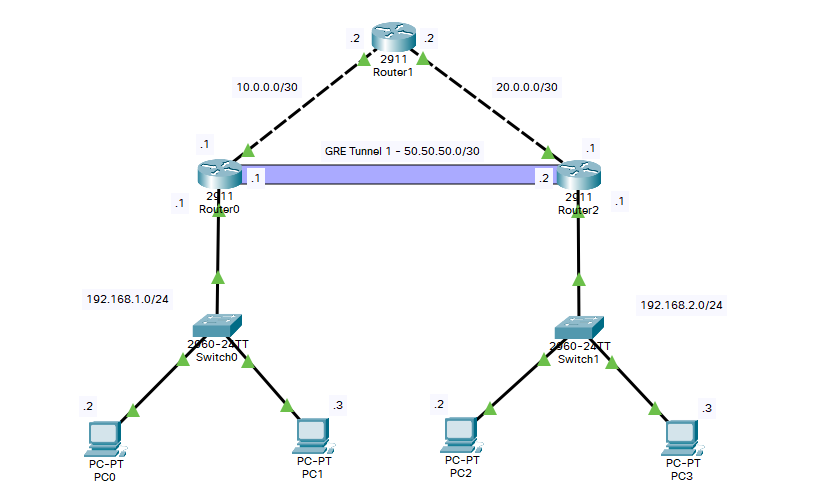
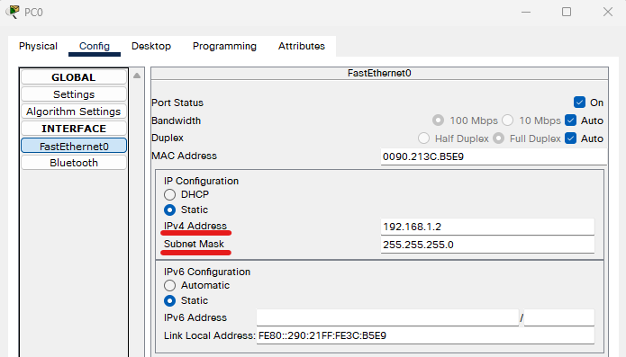
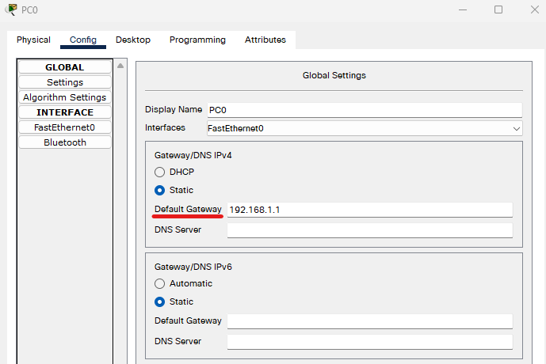
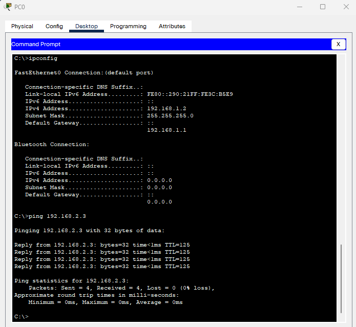
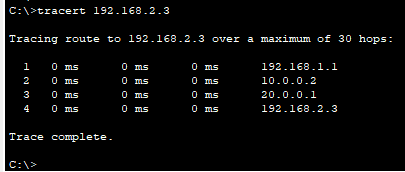
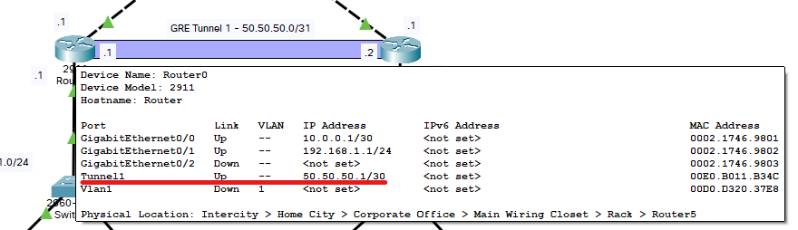
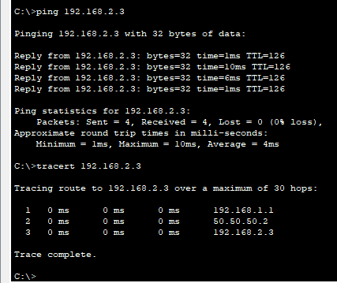
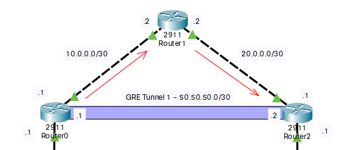

# Cisco Packet Tracer: Настройка GRE-туннеля

## Подготовка схемы сети
Начнем с расположения всех необходимых компонентов на рабочей панели Cisco Packet Tracer:



Таблица адресации:
| Device  | IP-address           | Subnet Mask     |
|---------|--------------------- |:---------------:|
| Router0 | Gig0/0 - 10.0.0.1    | 255.255.255.252 |
| Router0 | Gig0/1 - 192.168.1.1 | 255.255.255.252 |
| Router0 | Tunnel1 - 50.50.50.1 | 255.255.255.252 |
| Router1 | Gig0/0 - 10.0.0.2    | 255.255.255.252 |
| Router1 | Gig0/1 - 20.0.0.2    | 255.255.255.252 |
| Router2 | Gig0/0 - 20.0.0.1    | 255.255.255.252 |
| Router2 | Gig0/1 - 192.168.2.1 | 255.255.255.252 |
| Router2 | Tunnel1 - 50.50.50.2 | 255.255.255.252 |
| PC0     | 192.168.1.2          | 255.255.255.0   |
| PC1     | 192.168.1.3          | 255.255.255.0   |
| PC2     | 192.168.2.2          | 255.255.255.0   |
| PC3     | 192.168.2.3          | 255.255.255.0   |

Далее установим IP-адреса на всех интерфейсах:
1. Хосты:





2. Маршрутизаторы:

```sh
Router>enable
Router#configure terminal
Enter configuration commands, one per line.  End with CNTL/Z.
Router(config)#interface GigabitEthernet 0/0	- Выбор конкретного интерфейса маршрутизатора для настройки
Router(config-if)#ip address 10.0.0.1 255.255.255.252	 - Устанавливаем IP-адрес и маску
Router(config-if)#no shutdown	 - Активируем выбранный интерфейс
```

По аналогии настраиваем остальные интерфейсы на хостах. После этого, настроим динамическую маршрутизацию на основе протокола OSPF, чтобы не прописывать маршруты вручную.

```sh
# Конфигурирование OSPF для Router0

Router>enable
Router#configure terminal
Enter configuration commands, one per line.  End with CNTL/Z.
Router(config)#router ospf 10
Router(config-router)#network 192.168.1.0 0.0.0.255 area 0
Router(config-router)#network 10.0.0.0 0.0.0.3 area 0
Router(config-router)#end
Router#
%SYS-5-CONFIG_I: Configured from console by console

Router#
```

```sh
# Конфигурирование OSPF для Router2

Router>enable
Router#configure terminal
Enter configuration commands, one per line.  End with CNTL/Z.
Router(config)#router ospf 10
Router(config-router)#network 192.168.2.0 0.0.0.255 area 0
Router(config-router)#network 20.0.0.0 0.0.0.3 area 0
Router(config-router)#end
Router#
%SYS-5-CONFIG_I: Configured from console by console

Router#
```

```sh
# Конфигурирование OSPF для Router1

Router>enable
Router#configure terminal
Enter configuration commands, one per line.  End with CNTL/Z.
Router(config)#router ospf 10
Router(config-router)#network 10.0.0.0 0.0.0.3 area 0
Router(config-router)#network 20.0.0.0 0.0.0.3 area 0
Router(config-router)#end
Router#
%SYS-5-CONFIG_I: Configured from console by console

Router#
```

Теперь, мы можем проверить доступность одной подсети (192.168.1.0/24) для другой (192.168.2.0/24):



Как видим, пинги успешно ходят. Также помотрим маршрут, по которому проходят пинги:



Все, как и должно быть, пинги проходят все три маршрутизатора прежде, чем попасть на целевой хост, потому как прямого соединения между Router0 и Router2 нет. Посмотрим, что же будет, есть настроить GRE-туннель. Для начала, нам необходимо соответствующим образом настроить туннельные интерфейсы на маршрутизаторах:

```sh
# Конфигурирование GRE для Router0

Router>enable
Router#configure terminal
Enter configuration commands, one per line.  End with CNTL/Z.
Router(config)#interface tunnel 1

Router(config-if)#
%LINK-5-CHANGED: Interface Tunnel1, changed state to up

Router(config-if)#ip address 50.50.50.1 255.255.255.252
Router(config-if)#tunnel source GigabitEthernet 0/0
Router(config-if)#tunnel destination 20.0.0.1
Router(config-if)#
%LINEPROTO-5-UPDOWN: Line protocol on Interface Tunnel1, changed state to up

Router(config-if)#end
Router#
%SYS-5-CONFIG_I: Configured from console by console

Router#
```

```sh
# Конфигурирование GRE для Router2

Router>enable
Router#configure terminal
Enter configuration commands, one per line.  End with CNTL/Z.
Router(config)#interface tunnel 1

Router(config-if)#
%LINK-5-CHANGED: Interface Tunnel1, changed state to up

Router(config-if)#ip address 50.50.50.2 255.255.255.252
Router(config-if)#tunnel source GigabitEthernet 0/0
Router(config-if)#tunnel destination 10.0.0.1
Router(config-if)#
%LINEPROTO-5-UPDOWN: Line protocol on Interface Tunnel1, changed state to up

Router(config-if)#end
Router#
%SYS-5-CONFIG_I: Configured from console by console

Router#
```



Проверям тот факт, что новые сетевые интерфейсы видят друг друга:

```sh
Router>ping 50.50.50.2

Type escape sequence to abort.
Sending 5, 100-byte ICMP Echos to 50.50.50.2, timeout is 2 seconds:
!!!!!
Success rate is 100 percent (5/5), round-trip min/avg/max = 0/0/1 ms

Router>
```

```sh
# Маршрут на Router0

Router>enable
Router#configure terminal
Enter configuration commands, one per line.  End with CNTL/Z.
Router(config)#ip route 192.168.2.0 255.255.255.0 50.50.50.2
Router(config)#
```

```sh
# Маршрут на Router2

Router>enable
Router#configure terminal
Enter configuration commands, one per line.  End with CNTL/Z.
Router(config)#ip route 192.168.1.0 255.255.255.0 50.50.50.1
Router(config)#
```

Вновь проверяем маршрут с PC0 (192.168.1.2) до PC3 (192.168.2.3)



Как видим, маршрут изменился - теперь трафик проходит через GRE-туннель

Заметка: для данного практического задания характерная маршрутизация OSPF. Так как трафик между маршрутизаторами Router0 и Router2 ходит не напрямую, а через Router1, то нам необходима хоть какая-то маршрутизация, чтобы трафик (даже без обертки GRE) мог в принципе ходить между подсетями. Как только мы смогли достучаться из одной подети в другую, значит, мы реализовали маршртизацию. Теперь вопрос с туннелем. На схеме в самом начале было показано, что GRE соединил между собой два роутера "как бы напрямую", но на самом деле, это работает немного не так. Ниже представлена схема того, как ходит трафик через GRE-туннель:



По факту, протокол GRE просто инкапсулирует трафик, поэтому в tracert мы видели не два адреса (из подсетей 10.0.0.0/30 и 20.0.0.0/30), а один (из подсети 50.50.50.0/30) (см. рисунки выше). Получается, что логически два маршрутизатора соединены вместе напрямую, но при этом физически трафик все также проходит через Router1.  
