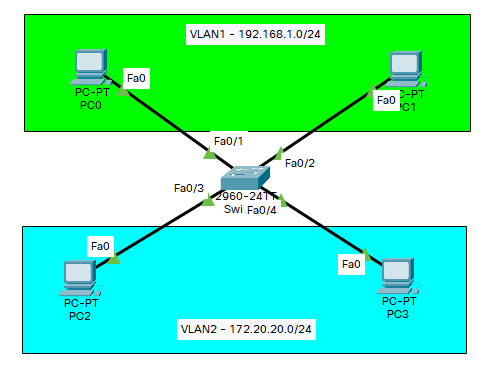
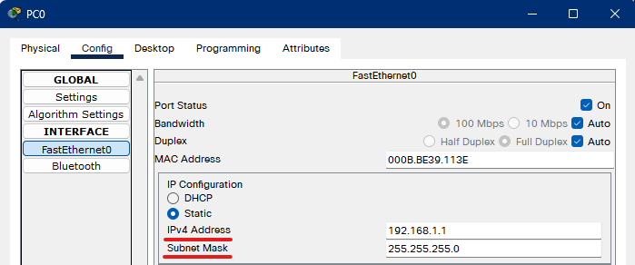
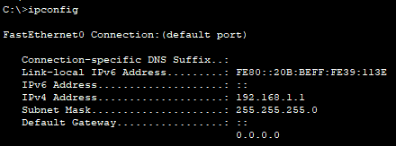
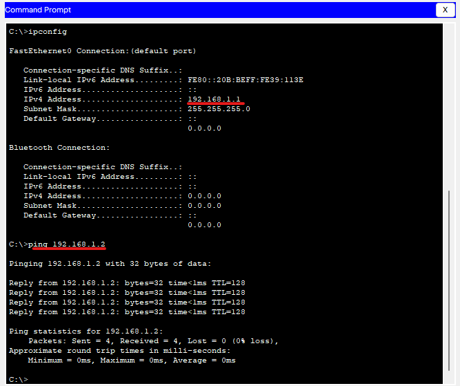
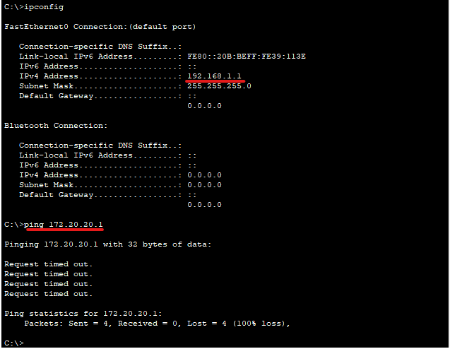
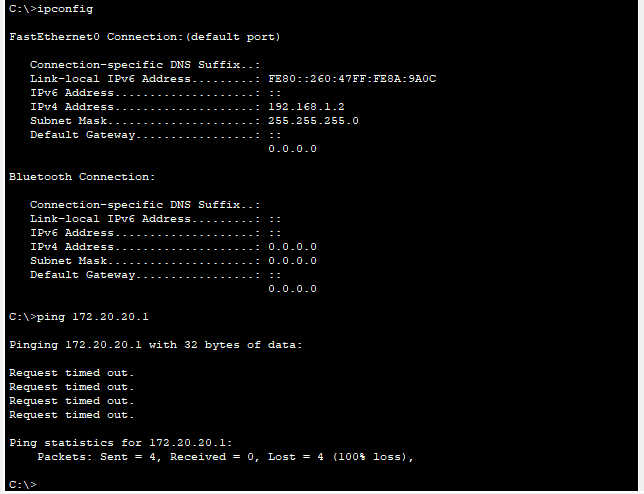
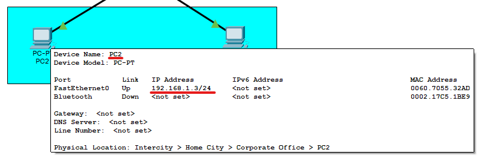
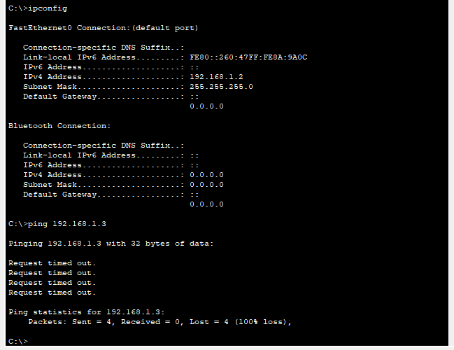

# Cisco Packet Tracer: Базовая настройка VLAN'ов

Для начала расположим на рабочем поле 4 ПК и 1 Коммутатор. При соединении учитываем, что PC0 подключен к порту FasteEthernet0/1, PC1 к порту FasteEthernet0/2 и т.д. Далее будим считать, что ПК 1 (PC 0) и ПК 2 (PC 1) находятся в vlan 1 с адресацией 192.168.1.0/24, ПК 3 (PC 2) и ПК 4 (PC 3) в vlan 2 с адресацией 172.20.20.0/24.



| PC  | IP-address  | Subnet Mask   |
|-----|------------:|:-------------:|
| PC0 | 192.168.1.1 | 255.255.255.0 |
| PC1 | 192.168.1.2 | 255.255.255.0 |
| PC2 | 172.20.20.1 | 255.255.255.0 |
| PC3 | 172.20.20.2 | 255.255.255.0 |

Устанавливаем IP-адреса на ПК:





По аналогии присваиваем IP-адреса остальным компьютерам, опираясь на таблицу адресации.

Теперь, проверим доступность одних хостов для других. Для начала реализуем ping c PC0 (192.168.1.1) на PC1 (192.168.1.2):



Как видим, хосты видят друг друга, но что же касается хостов, которые находятся в разных подсетях?



Хосты из одной подсети не видят хосты из другой подсети. Почему это происходит? Хотя в данном случае все четыре компьютера находятся в одном VLAN (по умолчанию все порты коммутатора находятся в VLAN 1), все они не могут видеть друг друга, так как находятся в разных подсетях. Компьютеры PC0 и PC1 находятся в подсети 192.168.1.0/24, а компьютеры PC2 и PC3 в подсети 172.20.20.0/24.

Далее переходим к настройке коммутатора. Перейдем в привилегированный режим и просмотрим информацию о существующих на коммутаторе VLAN-ах:

```sh
Switch>enable
Switch#show vlan brief

VLAN Name                             Status    Ports
---- -------------------------------- --------- -------------------------------
1    default                          active    Fa0/1, Fa0/2, Fa0/3, Fa0/4
                                                Fa0/5, Fa0/6, Fa0/7, Fa0/8
                                                Fa0/9, Fa0/10, Fa0/11, Fa0/12
                                                Fa0/13, Fa0/14, Fa0/15, Fa0/16
                                                Fa0/17, Fa0/18, Fa0/19, Fa0/20
                                                Fa0/21, Fa0/22, Fa0/23, Fa0/24
                                                Gig0/1, Gig0/2
1002 fddi-default                     active    
1003 token-ring-default               active    
1004 fddinet-default                  active    
1005 trnet-default                    active    
Switch#
```

В результате выполнения команды **show vlan brief** на экране появится: номера vlan – первый столбец, название vlan - второй столбец, состояние vlan (работает он в данный момент или нет) – третий столбец, порты принадлежащие к данному vlan – четвертый столбец. Как мы видим по умолчанию на коммутаторе существует пять vlan-ов. Все порты коммутатора по умолчанию принадлежат vlan 1. Остальные четыре vlan являются служебными.

Переходим к настройке самих VLAN'ов:

```sh
Switch#configure terminal	- Переход в режим конфигурирования коммутатора
Enter configuration commands, one per line.  End with CNTL/Z.
Switch(config)#vlan 2	- Выбираем конкретный VLAN
Switch(config-vlan)#name subnet_192	- Присваиваем имя для VLAN
Switch(config-vlan)#interface range fastEthernet 0/1-2		- Указываем диапазон интерфейсов, которые будет обслуживать данный VLAN
Switch(config-if-range)#switchport mode access		- Конфигурируем выбранный порт (порты) коммутатора, как порт (порты) доступа (аксесс порт)
Switch(config-if-range)#switchport access vlan 2
Switch(config-if-range)#
Switch(config-if-range)#exit
Switch(config)#
Switch(config)#vlan 3
Switch(config-vlan)#name subnet_172
Switch(config-vlan)#interface range fastEthernet 0/3-4
Switch(config-if-range)#switchport mode access
Switch(config-if-range)#switchport access vlan 3
Switch(config-if-range)#
```

Теперь вновь посмотрим на список VLAN'ов:

```sh
Switch#show vlan brief

VLAN Name                             Status    Ports
---- -------------------------------- --------- -------------------------------
1    default                          active    Fa0/5, Fa0/6, Fa0/7, Fa0/8
                                                Fa0/9, Fa0/10, Fa0/11, Fa0/12
                                                Fa0/13, Fa0/14, Fa0/15, Fa0/16
                                                Fa0/17, Fa0/18, Fa0/19, Fa0/20
                                                Fa0/21, Fa0/22, Fa0/23, Fa0/24
                                                Gig0/1, Gig0/2
2    subnet_192                       active    Fa0/1, Fa0/2
3    subnet_172                       active    Fa0/3, Fa0/4
1002 fddi-default                     active    
1003 token-ring-default               active    
1004 fddinet-default                  active    
1005 trnet-default                    active    
Switch#
```

Видим, что мы создали две сети с названиями **subnet_192** (обслуживает первый и второй интерфейсы коммутатора) и **subnet_172** (обслуживает третий и четвертый интерфейсы коммутатора). Вновь проверяем доступность одной сети для другой и видим, что результат не поменялся (и не должен поменяться): 



Раз ничего не изменилось, то как же мы можем быть уверены, что наша конфигурация VLAN действительно работает? Для этого пойдем на маленькую хитрость - зададим компьютерам PC2 и PC3 IP адреса из сети 192.168.1.0/24. Например 192.168.1.3 и 192.168.1.4. И теперь снова попробуем пропинговать с компьютера PC0 остальные компьютеры сети.





Как видим снова ничего не изменилось, хотя все четыре компьютера теоретически должны находится в одной подсети 192.168.1.0/24 и видеть друг друга, на практике они находятся в разных виртуальных локальных сетях и поэтому не могут взаимодействовать между собой.
